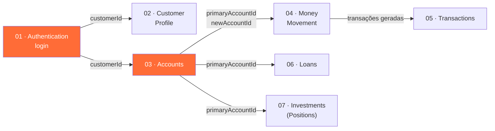

<div align="center">

# 🏦 ParaBank API Test Suite

**Suíte de testes de API automatizados para o [ParaBank](https://parabank.parasoft.com/), a aplicação de demonstração bancária da Parasoft.**

Postman • Newman • Allure Report


</div>

---

## Índice

- [Visão geral](#visão-geral)
- [Cobertura da API](#cobertura-da-api)
- [Fluxo de execução](#fluxo-de-execução)
- [Estrutura do projeto](#estrutura-do-projeto)
- [Pré-requisitos](#pré-requisitos)
- [Como rodar](#como-rodar)
- [Relatórios](#relatórios)
- [Pasta `09 - Admin` (opt-in, destrutiva)](#pasta-09---admin-opt-in-destrutiva)
- [Notas de validação e decisões técnicas](#notas-de-validação-e-decisões-técnicas)

---

## Visão geral

Este projeto cobre **100% dos 27 endpoints REST** do ParaBank (`/parabank/services/bank`, OpenAPI 3.0) com uma
collection Postman gerada programaticamente e executada via Newman. Os cenários incluem tanto caminhos felizes
quanto casos negativos (credenciais inválidas, IDs inexistentes, contas inexistentes), com variáveis encadeadas
entre requests para simular um fluxo de usuário real — login → contas → movimentações → extrato → empréstimo →
investimentos.

| | |
|---|---|
| **Endpoints cobertos** | 27 / 27 |
| **Requests na collection** | 28 |
| **Test scripts** | 56 |
| **Asserções** | 83 |
| **Formato da collection** | Postman Collection v2.1 |
| **Runner** | Newman (CLI) |
| **Relatórios** | CLI · JUnit XML · HTML (htmlextra) · Allure |

## Cobertura da API

A lista de endpoints e os schemas de resposta foram conferidos contra a documentação Swagger UI oficial
(`/parabank/api-docs/index.html`) e contra o código-fonte (`ParaBankService.java` e classes de domínio em
[parasoft/parabank](https://github.com/parasoft/parabank)).

| Pasta da collection | Endpoints |
|---|---|
| `01 · Authentication` | `GET /login/{username}/{password}` |
| `02 · Customer Profile` | `GET /customers/{id}` · `POST /customers/update/{id}` |
| `03 · Accounts` | `GET /customers/{id}/accounts` · `GET /accounts/{id}` · `POST /createAccount` |
| `04 · Money Movement` | `POST /billpay` · `POST /deposit` · `POST /withdraw` · `POST /transfer` |
| `05 · Transactions` | `GET /accounts/{id}/transactions` (+ `/amount`, `/month/{}/type/{}`, `/fromDate/{}/toDate/{}`, `/onDate/{}`) · `GET /transactions/{id}` |
| `06 · Loans` | `POST /requestLoan` |
| `07 · Investments (Positions)` | `POST /customers/{id}/buyPosition` · `POST /customers/{id}/sellPosition` · `GET /customers/{id}/positions` · `GET /positions/{id}` · `GET /positions/{id}/{startDate}/{endDate}` |
| `09 · Admin` 🔒 | `POST /setParameter/{name}/{value}` · `POST /shutdownJmsListener` · `POST /startupJmsListener` · `POST /initializeDB` · `POST /cleanDB` |

> `POST /billpay` recebe o payee como corpo JSON (schema `Payee`: `name`, `address{street,city,state,zipCode}`,
> `phoneNumber`, `accountNumber`) além de `accountId`/`amount` como query params, respondendo com `BillPayResult`
> (`payeeName`, `amount`, `accountId`).

## Fluxo de execução

As pastas `01`–`07` são encadeadas via variáveis de collection: cada request reaproveita dados capturados pelas
requests anteriores, simulando a jornada de um usuário real na aplicação.



A pasta `09 - Admin` fica **fora** desse fluxo e do `npm test` padrão — ela afeta a instância inteira (todos os
usuários simultâneos do ambiente compartilhado) e só roda sob demanda (veja [mais abaixo](#pasta-09---admin-opt-in-destrutiva)).

## Estrutura do projeto

```text
testing-api/
├── postman/
│   ├── ParaBank_API_Tests.postman_collection.json   # collection Postman v2.1 (27 endpoints)
│   └── ParaBank.postman_environment.json            # environment (baseUrl, credenciais)
├── scripts/
│   └── generate-collection.js                       # gera a collection programaticamente (fonte da verdade)
├── package.json                                      # scripts npm (test, report, generate)
└── README.md
```

> A collection é **gerada**, não editada manualmente — `scripts/generate-collection.js` é a fonte da verdade
> para as ~30 requests e seus test scripts. Depois de alterar o gerador, rode `npm run generate` para regravar o
> JSON da collection.

## Pré-requisitos

| Ferramenta | Versão | Uso |
|---|---|---|
| [Node.js](https://nodejs.org/) | ≥ 18 | Newman + gerador da collection |
| [Java (JRE)](https://adoptium.net/) | ≥ 8 | CLI do Allure (`allure generate` / `allure open`) |

## Como rodar

```bash
npm install

npm test          # roda as pastas 01-07 (seguras) + relatórios CLI/JUnit/HTML/Allure
npm run test:cli  # mesma coisa, só saída no terminal (sem gerar relatórios em arquivo)
```

Variáveis do environment (`postman/ParaBank.postman_environment.json`):

| Variável | Padrão | Descrição |
|---|---|---|
| `baseUrl` | `https://parabank.parasoft.com/parabank/services/bank` | Base da API |
| `username` | `john` | Conta de demonstração publicamente documentada do ParaBank |
| `password` | `demo` | — |

Ajuste-as (ou passe `--env-var chave=valor` ao Newman) para apontar para outra instância/conta.

## Relatórios

| Comando | Saída |
|---|---|
| `npm test` | CLI + `newman/report.xml` (JUnit) + `newman/report.html` (htmlextra) + `allure-results/` |
| `npm run report:allure:generate` | Converte `allure-results/` em `allure-report/` (HTML navegável) |
| `npm run report:allure:open` | Abre `allure-report/` num servidor local |
| `npm run test:allure` | Roda os três passos acima em sequência |

`allure-results/` é limpo no início de cada `npm test`, para não acumular execuções antigas, e não é versionado
(está no `.gitignore`). O relatório Allure traz, por request: status (passed/failed/broken), duração, cada
`pm.test()` como um step, e os dados brutos de request/response (URL, headers, body) como anexos — útil para
depurar uma falha sem rodar a collection de novo no Postman.

> **Java é obrigatório** para o CLI do Allure (pacote `allure-commandline`, incluído nas `devDependencies`) — é
> uma dependência do próprio Allure, não do Node. Sem Java, `allure generate`/`allure open` falham mesmo com os
> pacotes npm instalados.

## Pasta `09 - Admin` (opt-in, destrutiva)

```bash
npm run test:admin
```

Cobre os 5 endpoints administrativos restantes: `initializeDB` (reseta todos os dados para o estado padrão),
`cleanDB` (apaga o banco inteiro), `setParameter` e o par `shutdownJmsListener`/`startupJmsListener`.

> ⚠️ **Não rode isso contra o ambiente público compartilhado** a menos que você aceite resetar/apagar os dados de
> todos os usuários simultâneos. Use apenas contra uma instância própria (ex.: ParaBank rodando localmente via
> Docker/Maven).

## Notas de validação e decisões técnicas

<details>
<summary><strong>Como a cobertura foi validada</strong> (o ambiente de desenvolvimento não tinha acesso direto ao ParaBank ao vivo)</summary>

<br>

O ambiente onde este projeto foi desenvolvido bloqueia acesso de rede a `parabank.parasoft.com` por política
organizacional. Para garantir a fidelidade da collection mesmo assim, a validação seguiu duas frentes:

1. **Especificação oficial**: o usuário exportou a documentação Swagger UI real (`/parabank/api-docs/index.html`)
   em PDF, permitindo conferir todos os 27 endpoints, parâmetros e schemas de resposta contra a especificação
   OpenAPI oficial — o que revelou e corrigiu um endpoint inteiro faltando (`POST /billpay`) e um campo de
   resposta incorreto (`Position` serializa o id como `positionId`, não `id`).
2. **Validação funcional**: a lógica de cada request/teste (parsing de resposta, encadeamento de variáveis,
   asserções) foi validada rodando a collection completa contra um mock HTTP local que replica os 27 endpoints —
   28 requests, 56 test scripts, 83 asserções, com apenas 1 falha esperada (uma simplificação do mock, não um
   defeito na collection).

Dois comportamentos não puderam ser confirmados nem pela documentação nem pelo mock, por dependerem de regras de
negócio internas do servidor real:

- **Formato de data** de `GET /positions/{id}/{startDate}/{endDate}` (histórico de posição) — assumido
  `yyyy-MM-dd`. Se a instância real esperar outro formato, ajuste `thirtyDaysAgoYMD`/`todayYMD` no pre-request
  script da collection.
- **Comportamento de limite** em `POST /withdraw` (saque acima do saldo) e `POST /requestLoan` (valores
  extremos) — os testes documentam o comportamento observado via `console.log` em vez de travar numa regra de
  negócio não confirmada.

Recomenda-se rodar `npm test` num ambiente com acesso de rede ao ParaBank para validar esses dois pontos contra o
servidor real.

</details>

---

<div align="center">

Feito para exercitar a [API REST do ParaBank](https://parabank.parasoft.com/) — um projeto de demonstração/estudo da Parasoft.

</div>
